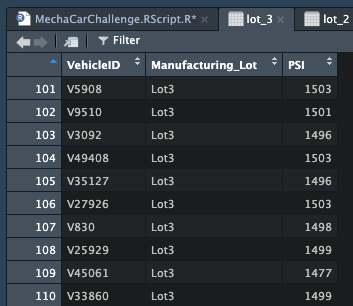

# MechaCar_Statistical_Analysis

## Overview
In this analysis we looked at data from AutosRUs’ newest prototype, the MechaCar, which is suffering from production issues that are impeding their progress.  Using linear regression analysis, summary statistics and t-tests in R-Studio with the data provided we aim to reveal insights that may help the manufacturing team.

### Resources

- Software:
    - RStudio(version 2022.12.0+353)
- Starting Data:
    - MechaCar MPG Data
        - [deliverables/deliverable_resources/MechaCar_mpg.csv](deliverables/deliverable_resources/MechaCar_mpg.csv)
    - Suspension Coil Data
        - [deliverables/deliverable_resources/Suspension_Coil.csv](deliverables/deliverable_resources/Suspension_Coil.csv)

## Results

### Generated Code 
- MechaCar Challenge R Code 
    - [deliverables/MechaCarChallenge.RScript.R](deliverables/MechaCarChallenge.RScript.R)

## Visualizations and Analysis 

### Part 1: Linear Regression to Predict MPG
#### Summary
- The vehicle weight and ground clearance have the weakest relation to the variance. 
- The slope of the linear model is not considered to be zero. The p-value is significantly less then the .05 significant level. 
- The linear model predicts mpg prototypes effectively because the multiple r-squared number is 0.71, therefor most of the variances can be explained by the mpg. 

### Linear Regression 
- [deliverables/deliverable_images/linear_regression.png](deliverables/deliverable_images/linear_regression.png)

### MechaCar Data Summary
- [deliverables/deliverable_images/mecha_data_summary.png](deliverables/deliverable_images/mecha_data_summary.png)

### Part 2: Create Visualizations for the Trip Analysis
#### Summary
- All together the lots meet the specifications. Lot 1 and 2 are very similar and are within the design specifications. Lot 3 exceeds the specifications, its variance exceeds specifications. 

### Total Summary on Suspension Coil Data
- [deliverables/deliverable_images/total_summary.png](deliverables/deliverable_images/total_summary.png)

### Lot Summary on Suspension Coil Data
- [deliverables/deliverable_images/lot_summary.png](deliverables/deliverable_images/lot_summary.png)

### Part 3: T-Tests on Suspension Coils

### T-Test on Suspension Coil Data
- [deliverables/deliverable_images/t_test_coil_data.png](deliverables/deliverable_images/t_test_coil_data.png)

- T-test for all lots vs. mean of 1500 PSI - no statistical difference.

### Lot 1 Data
- [deliverables/deliverable_images/lot_1.png](deliverables/deliverable_images/lot_1.png)

### T-Test on Lot 1 Data
- [deliverables/deliverable_images/t_test_lot_1.png](deliverables/deliverable_images/t_test_lot_1.png)

- T-test for lot 1 vs. mean of 1500 PSI - no statistical difference.

### Lot 2 Data
- [deliverables/deliverable_images/lot_2.png](deliverables/deliverable_images/lot_2.png)

### T-Test on Lot 2 Data
- [deliverables/deliverable_images/t_test_lot_2.png](deliverables/deliverable_images/t_test_lot_2.png)

- T-test for lot 3 vs. mean of 1500 PSI - no statistical difference.

### Lot 3 Data
- [deliverables/deliverable_images/lot_3.png](deliverables/deliverable_images/lot_3.png)

### T-Test on Lot 3 Data
- [deliverables/deliverable_images/t_test_lot_3.png](deliverables/deliverable_images/t_test_lot_3.png)

- T-test for lot 3 vs. mean of 1500 PSI - yes, a statistical difference.

## Part 4: Study Design: MechaCar vs Competition.
Cost is one of the most important things to consumers, therefor the price of the car and the expenses to keep it running are going to play a huge role in consumer interest. The null hypothesis would be “There is no significant difference in cost between MechaCar and its competition.” We would use a one sample T-Test to test the null hypothesis using the average car cost as the variable we are testing. The data we would need to run this test is the car prices. 
